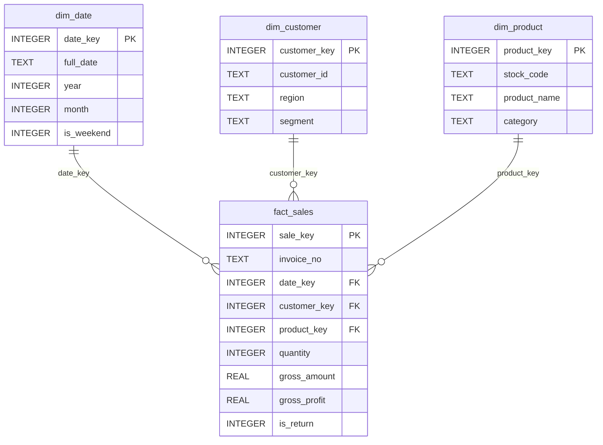

# 数据仓库设计

## ER 图

## 处理步骤

1. CSV 进入 staging 表。
2. 清洗日期、金额、数量和客户标识。
3. 生成 `dim_date`、`dim_customer`、`dim_product`。
4. 将客户、商品和日期映射为代理键。
5. 计算销售金额、成本和毛利。
6. 生成 KPI、趋势、品类、区域、商品排名和 RFM 视图。
7. 导出 Tableau 数据文件并打包工作簿。

## 设计取舍

- 本地默认使用 SQLite，便于无服务器复现；同时保留 MySQL 8 脚本作为生产接入参考。
- 退货通过负数量进入事实表，不使用删除数据的方式修正，确保审计可追溯。
- `customer_key` 保留 `UNKNOWN` 占位，避免未知客户导致事实行丢失。